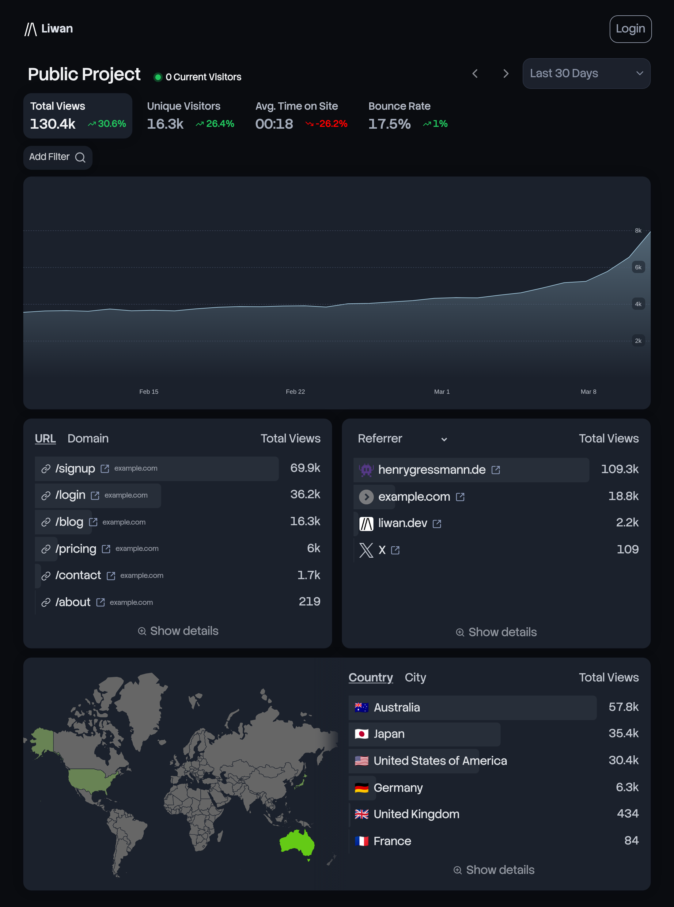
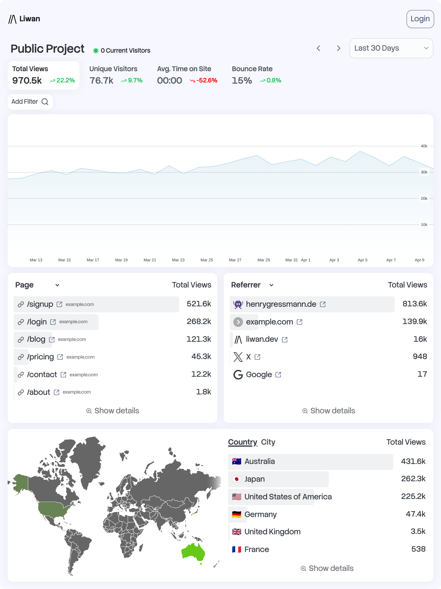

 

    <h2>
        
        <a href="https://liwan.dev">liwan.dev</a> - Easy & Privacy-First Web Analytics
    </h2>
    

[![brainmade.org](https://img.shields.io/badge/brainmade.org-FFFFFF?style=flat-square&logo=data%3Aimage%2Fsvg%2Bxml%3Bbase64%2CPHN2ZyB4bWxucz0iaHR0cDovL3d3dy53My5vcmcvMjAwMC9zdmciIHdpZHRoPSIxZW0iIGhlaWdodD0iNzkiIHZpZXdCb3g9IjAgMCA2NyA3OSIgZmlsbD0ibm9uZSI%2BPHBhdGggZmlsbD0iIzAwMCIgZD0iTTUyLjYxMiA3OC43ODJIMjMuMzNhMi41NTkgMi41NTkgMCAwIDEtMi41Ni0yLjU1OHYtNy42NzdoLTcuOTczYTIuNTYgMi41NiAwIDAgMS0yLjU2LTIuNTZWNTUuMzE1bC04LjgyLTQuMzk3YTIuNTU5IDIuNTU5IDAgMCAxLS45ODYtMy43MWw5LjgwNy0xNC43MTR2LTQuMzVDMTAuMjQgMTIuNTk5IDIyLjg0MyAwIDM4LjM4OCAwIDUzLjkzMiAwIDY2LjUzNCAxMi42IDY2LjUzOCAyOC4xNDNjLS42MzIgMjcuODI0LTEwLjc2IDIzLjUxNi0xMS4xOCAzNC4wNDVsLS4xODcgMTQuMDM1YTIuNTkgMi41OSAwIDAgMS0uNzUgMS44MSAyLjU1IDIuNTUgMCAwIDEtMS44MDkuNzVabS0yNi43MjMtNS4xMTdoMjQuMTY0bC4yODYtMTQuNTQyYy0uMjYzLTYuNjU2IDExLjcxNi04LjI0MyAxMS4wOC0zMC43MzQtLjM1OC0xMi43MTMtMTAuMzEzLTIzLjI3MS0yMy4wMzEtMjMuMjcxLTEyLjcxOCAwLTIzLjAyOSAxMC4zMDctMjMuMDMyIDIzLjAyNXY1LjExN2MwIC41MDYtLjE1IDEtLjQzIDEuNDJsLTguNjMgMTIuOTQxIDcuNjQ1IDMuODJhMi41NTkgMi41NTkgMCAwIDEgMS40MTUgMi4yOTF2OS42OTdoNy45NzRhMi41NTkgMi41NTkgMCAwIDEgMi41NiAyLjU1OXY3LjY3N1oiLz48cGF0aCBmaWxsPSIjMDAwIiBkPSJNNDAuMzcyIDU4LjIyMlYzOC45MzRjLjExOCAwIC4yMzcuMDE4LjM1NS4wMTggOS43NjktLjAxMiAxNy4wNS05LjAxMiAxNS4wMjItMTguNTY3YTIuMzY2IDIuMzY2IDAgMCAwLTEuODIxLTEuODIyYy04LjEwNi0xLjczLTE2LjEyMSAzLjI5Mi0xOC4wOTggMTEuMzQxLS4wMjQtLjAyNC0uMDQzLS4wNS0uMDY2LS4wNzNhMTUuMzIzIDE1LjMyMyAwIDAgMC0xNC4wNi00LjE3IDIuMzY1IDIuMzY1IDAgMCAwLTEuODIxIDEuODJjLTIuMDI4IDkuNTU1IDUuMjUyIDE4LjU1NCAxNS4wMiAxOC41NjguMjM2IDAgLjQ5Mi0uMDI4LjczOC0uMDR2MTIuMjEzaDQuNzMxWm0yLjgzOS0zMi4xNDNhMTAuNjQ2IDEwLjY0NiAwIDAgMSA4LjEyNC0zLjEwNmMuMzUgNi4zNC00Ljg4OCAxMS41NzctMTEuMjI4IDExLjIzYTEwLjU4IDEwLjU4IDAgMCAxIDMuMTA0LTguMTI0Wk0yNy40MDMgMzguMTkzYTEwLjYwNyAxMC42MDcgMCAwIDEtMy4xMTgtOC4xMjNjNi4zNDQtLjM1OCAxMS41ODcgNC44ODYgMTEuMjI4IDExLjIzLTMuMDIzLjE2OS01Ljk3My0uOTYxLTguMTEtMy4xMDdaIi8%2BPC9zdmc%2B)](https://brainmade.org/)

&nbsp;&nbsp;&nbsp;

## Features

- **Quick setup**\
  Quickly get started with Liwan with a single, self-contained binary . No database or complex setup required. The tracking script is a single line of code that works with any website and less than 1KB in size.
- **Privacy first**\
  Liwan respects your users’ privacy by default. No cookies, no cross-site tracking, no persistent identifiers. All data is stored on your server.
- **Lightweight**\
  You can run Liwan on a cheap VPS, your old mac mini, or even a Raspberry Pi. Written in Rust and using tokio for async I/O, Liwan is fast and efficient.
- **Open source**\
  Fully open source. You can change, extend, and contribute to the codebase.
- **Accurate data**\
  Get accurate data about your website’s visitors, page views, referrers, and more. Liwan detects bots and crawlers and filters them out by default.
- **Real-time analytics**\
  See your website’s traffic in real-time. Liwan updates the dashboard automatically as new visitors come in.

## License

Unless otherwise noted, the code in this repository is available under the terms of the Apache-2.0 license. See [LICENSE](LICENSE.md) for more information.
