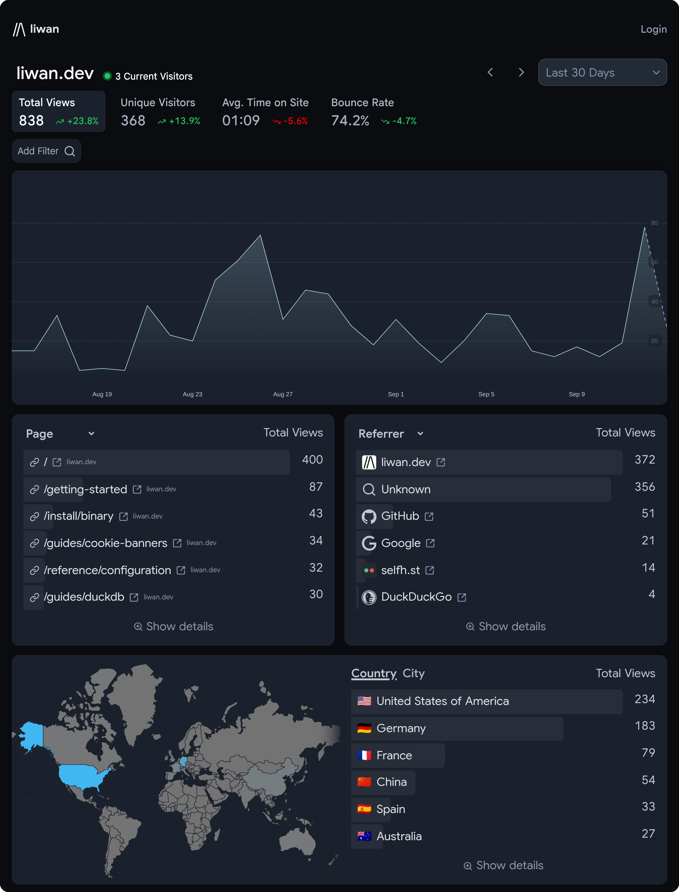
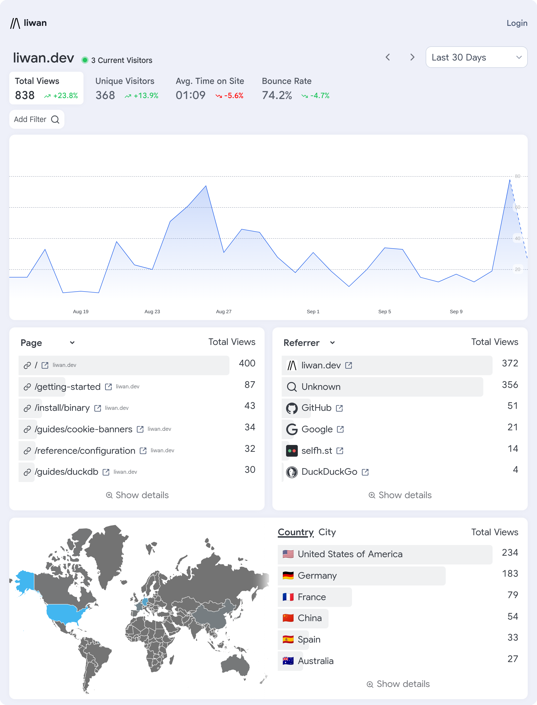

 

    <h2>
        
        <a href="https://liwan.dev">liwan.dev</a> - Self-hosted, privacy-first web analytics
    </h2>

[Live demo](https://demo.liwan.dev/p/liwan.dev) · [Getting started](https://liwan.dev/getting-started/) · [Configuration](https://liwan.dev/reference/configuration/) · [Collected data](https://liwan.dev/collected-data/)

&nbsp;&nbsp;&nbsp;

## Features

**Understand your traffic**\
See your most-visited pages, where visitors come from, and how traffic changes over time. The dashboard updates automatically, with bot filtering enabled by default.

**Easy to self-host**\
Run Liwan as a single binary or Docker container. The dashboard and database are built in, with no additional services to manage.

**Privacy first**\
No tracking cookies or cross-site tracking. Your analytics data stays on your server, and you control what’s collected and how long it’s kept.
[Read more about data collection](https://liwan.dev/collected-data/).

**Collect only what you need**\
Choose what data to collect and how long to keep it. Location detail is adjustable, and campaign attribution and session metrics can be disabled independently.

**Lightweight tracking**\
Add a small tracking script to your website with a single line of HTML. Works with any framework or CMS.

**Single sign-on**\
Manage accounts with Google Workspaces, Microsoft Entra, or your own OpenID Connect provider like Keycloak or Dex.

## License

Unless otherwise noted, this repository is licensed under the [Apache License, Version 2.0](LICENSE.md).

Unless you explicitly state otherwise, any contribution intentionally submitted for inclusion in Liwan by you, as defined in the Apache-2.0 license, shall be licensed under Apache-2.0, without any additional terms or conditions.
