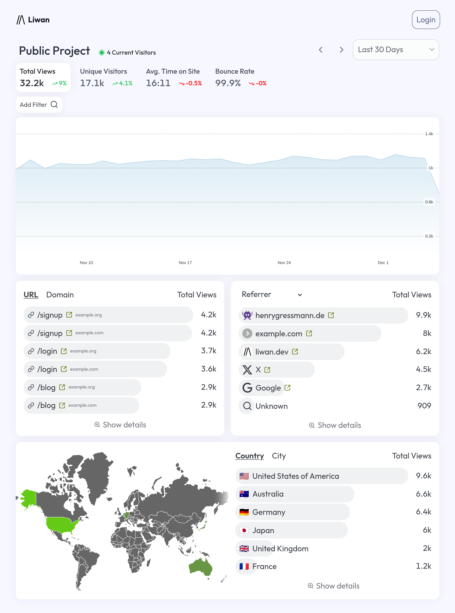

 

    
    <h2>
        <a href="https://liwan.dev">liwan.dev</a> - Easy & Privacy-First Web Analytics
    </h2>
    

&nbsp;&nbsp;&nbsp;

## Features

- **Quick setup**\
  Quickly get started with Liwan with a single, self-contained binary . No database or complex setup required. The tracking script is a single line of code that works with any website and less than 1KB in size.
- **Privacy first**\
  Liwan respects your users’ privacy by default. No cookies, no cross-site tracking, no persistent identifiers. All data is stored on your server.
- **Lightweight**\
  You can run Liwan on a cheap VPS, your old mac mini, or even a Raspberry Pi. Written in Rust and using tokio for async I/O, Liwan is fast and efficient.
- **Open source**\
  Fully open source. You can change, extend, and contribute to the codebase.
- **Accurate data**\
  Get accurate data about your website’s visitors, page views, referrers, and more. Liwan detects bots and crawlers and filters them out by default.
- **Real-time analytics**\
  See your website’s traffic in real-time. Liwan updates the dashboard automatically as new visitors come in.

## License

Unless otherwise noted, the code in this repository is available under the terms of the GNU AGPLv3 license. See [LICENSE](LICENSE.md) for more information.
The tracking client (contained in `tracker/`) is available as a separate library under the terms of the MIT license (see [LICENSE](tracker/LICENSE.md)) to allow for easier integration into other projects without the possibility of AGPLv3 contamination.

For commercial licensing options, contact [hi@liwan.dev](mailto:hi@liwan.dev).

### Third-party licenses

- `data/ua_regexes.yaml` is based on data from [ua-parser/uap-core](https://github.com/ua-parser/uap-core/blob/master/regexes.yaml) (Copyright 2009 Google Inc. and available under the Apache License, Version 2.0)
- `data/spammers.txt` is in the public domain (see [matomo-org/referrer-spam-list](https://github.com/matomo-org/referrer-spam-list))
- `data/socials.txt` is based on [matomo-org/searchengine-and-social-list](https://github.com/matomo-org/searchengine-and-social-list) (available under the CC0 1.0 Universal Public Domain Dedication)
- `data/geo.json` is based on data from [Natural Earth](https://naturalearthdata.com/) (which itself is in the public domain)
- See [CONTRIBUTING](CONTRIBUTING.md) for more information on licensing of contributions from external contributors.
