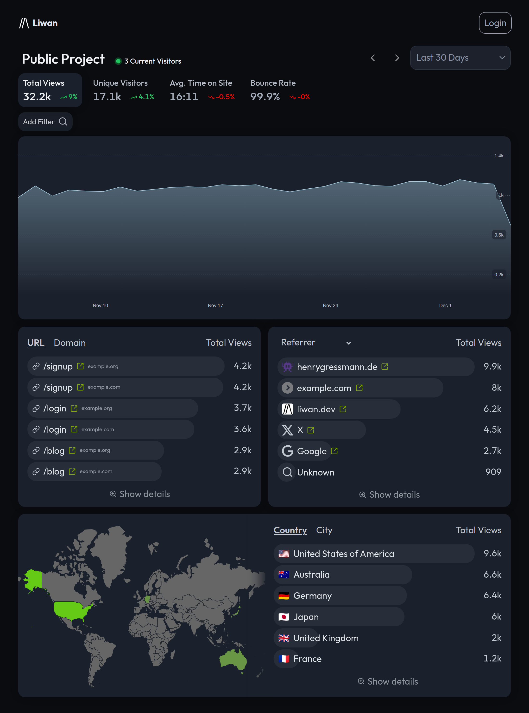

 

    <h2>
        
        <a href="https://liwan.dev">liwan.dev</a> - Easy & Privacy-First Web Analytics
    </h2>
    

&nbsp;&nbsp;&nbsp;

## Features

- **Quick setup**\
  Quickly get started with Liwan with a single, self-contained binary . No database or complex setup required. The tracking script is a single line of code that works with any website and less than 1KB in size.
- **Privacy first**\
  Liwan respects your users’ privacy by default. No cookies, no cross-site tracking, no persistent identifiers. All data is stored on your server.
- **Lightweight**\
  You can run Liwan on a cheap VPS, your old mac mini, or even a Raspberry Pi. Written in Rust and using tokio for async I/O, Liwan is fast and efficient.
- **Open source**\
  Fully open source. You can change, extend, and contribute to the codebase.
- **Accurate data**\
  Get accurate data about your website’s visitors, page views, referrers, and more. Liwan detects bots and crawlers and filters them out by default.
- **Real-time analytics**\
  See your website’s traffic in real-time. Liwan updates the dashboard automatically as new visitors come in.

## ⚡ One-Click Deploy

| Cloud Provider | Deploy Button |
|----------------|---------------|
| AWS |  |
| DigitalOcean |  |
| Render |  |
| Helm | `helm repo add deploystack https://deploystackio.github.io/deploy-templates/` `helm repo update` `helm install explodingcamera-liwan deploystack/explodingcamera-liwan` |

Change or add deploy options at [awesome-docker-run](https://github.com/deploystackio/awesome-docker-run/tree/main/commands/liwan)

Generated by <a href="https://deploystack.io/c/explodingcamera-liwan" target="_blank">DeployStack.io</a>

## License

Unless otherwise noted, the code in this repository is available under the terms of the Apache-2.0 license. See [LICENSE](LICENSE.md) for more information.
